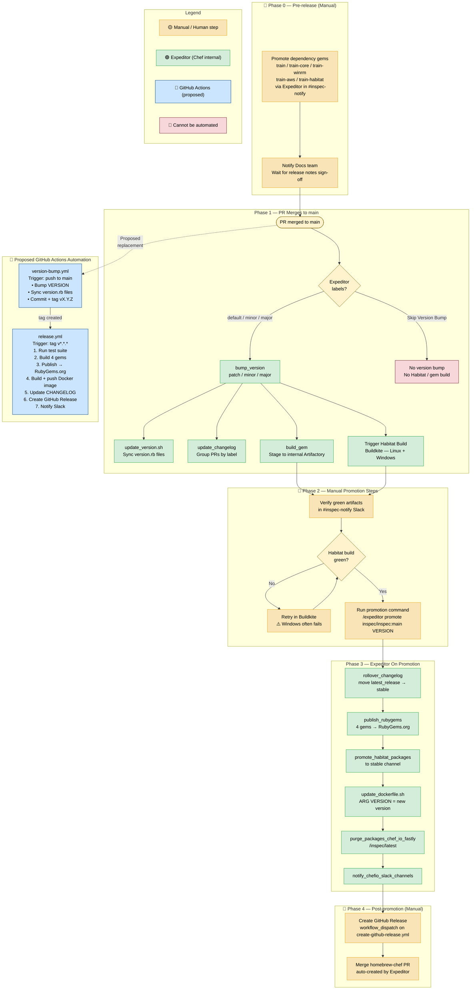

```mermaid
flowchart TD
    %% ── Styles ──────────────────────────────────────────────
    classDef human    fill:#f9e4b7,stroke:#e6a817,color:#000
    classDef expeditor fill:#d4edda,stroke:#28a745,color:#000
    classDef actions  fill:#cce5ff,stroke:#004085,color:#000
    classDef decision fill:#fff3cd,stroke:#856404,color:#000
    classDef blocked  fill:#f8d7da,stroke:#721c24,color:#000

    %% ── Phase 0: Pre-release (Manual) ──────────────────────
    subgraph PRE["🧑 Phase 0 — Pre-release (Manual)"]
        A1["Promote dependency gems\ntrain / train-core / train-winrm\ntrain-aws / train-habitat\n via Expeditor in #inspec-notify"]:::human
        A2["Notify Docs team\nWait for release notes sign-off"]:::human
        A1 --> A2
    end

    %% ── Phase 1: PR Merge ────────────────────────────────────
    subgraph MERGE["Phase 1 — PR Merges to main"]
        B1(["PR merged to main"]):::decision
        B2{"Expeditor\nlabels?"}:::decision
        B3["bump_version\npatch / minor / major"]:::expeditor
        B4["update_version.sh\nSync version.rb files"]:::expeditor
        B5["update_changelog\nGroup PRs by label"]:::expeditor
        B6["build_gem\nStage to internal Artifactory"]:::expeditor
        B7["Trigger Habitat Build\nBuildkite — Linux + Windows"]:::expeditor

        B1 --> B2
        B2 -->|"Skip Version Bump"| B_SKIP["No version bump\nNo Habitat / gem build"]:::blocked
        B2 -->|default / minor / major| B3
        B3 --> B4
        B3 --> B5
        B3 --> B6
        B3 --> B7
    end

    %% ── Phase 2: Manual Promotion ────────────────────────────
    subgraph PROMOTE["🧑 Phase 2 — Manual Promotion Steps"]
        C1["Verify green artifacts\nin #inspec-notify Slack"]:::human
        C2{"Habitat build\ngreen?"}:::decision
        C3["Retry in Buildkite\n⚠️ Windows often fails"]:::human
        C4["Run promotion command\n/expeditor promote inspec/inspec:main VERSION"]:::human

        C1 --> C2
        C2 -->|No| C3
        C3 --> C2
        C2 -->|Yes| C4
    end

    %% ── Phase 3: Expeditor On Promotion ─────────────────────
    subgraph EXPROM["Phase 3 — Expeditor On Promotion"]
        D1["rollover_changelog\nmove latest_release → stable"]:::expeditor
        D2["publish_rubygems\n4 gems → RubyGems.org"]:::expeditor
        D3["promote_habitat_packages\nto stable channel"]:::expeditor
        D4["update_dockerfile.sh\nARG VERSION = new version"]:::expeditor
        D5["purge_packages_chef_io_fastly\n/inspec/latest"]:::expeditor
        D6["notify_chefio_slack_channels"]:::expeditor

        D1 --> D2 --> D3 --> D4 --> D5 --> D6
    end

    %% ── Phase 4: Post-promotion (Manual) ────────────────────
    subgraph POST["🧑 Phase 4 — Post-promotion (Manual)"]
        E1["Create GitHub Release\nworkflow_dispatch on create-github-release.yml"]:::human
        E2["Merge homebrew-chef PR\nauto-created by Expeditor"]:::human
        E1 --> E2
    end

    %% ── Proposed GitHub Actions (Future) ────────────────────
    subgraph GHA["🔵 Proposed GitHub Actions Automation"]
        direction TB
        F1["version-bump.yml\nTrigger: push to main\n• Bump VERSION\n• Sync version.rb files\n• Commit + tag vX.Y.Z"]:::actions
        F2["release.yml\nTrigger: tag v*.*.*\n1. Run test suite\n2. Build 4 gems\n3. Publish → RubyGems.org\n4. Build + push Docker image\n5. Update CHANGELOG\n6. Create GitHub Release\n7. Notify Slack"]:::actions
        F1 -->|tag created| F2
    end

    %% ── Connections ──────────────────────────────────────────
    A2 --> B1
    B6 --> C1
    B7 --> C1
    C4 --> D1
    D6 --> E1

    %% Proposed replaces phases 1 + 3 partially
    B1 -.->|"Proposed\nreplacement"| F1

    %% ── Legend ──────────────────────────────────────────────
    subgraph LEGEND["Legend"]
        L1["🟡 Manual / Human step"]:::human
        L2["🟢 Expeditor (Chef internal)"]:::expeditor
        L3["🔵 GitHub Actions (proposed)"]:::actions
        L4["🔴 Cannot be automated"]:::blocked
    end
```
