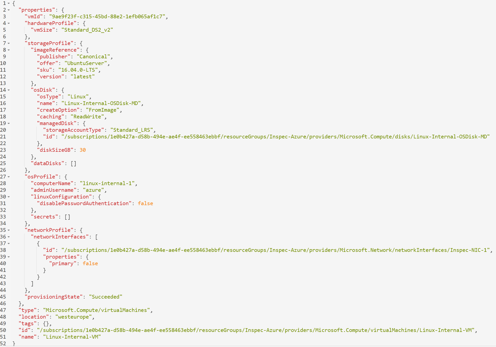

# InSpec for Azure

This Resource Pack has been been completely rewritten so that it is able to check for _any_ resource in Azure, previous versions only supported 4 resource types.

Whenever an Azure resource is retrieved its attributes are interrogated and turned into things that can be called during tests on that particular resource. By making the profile dynamic it means that more or less any resource that is available in Azure can be tested.

To determine what methods can be called against an Azure resource please find the resource in https://resources.azure.com. The attributes of the resource are turned into the methods that can be called. Please refer to the examples further down the page or the integration tests for more information.

The only caveat to this is that the generic resource cannot interrogate an Azure resource group itself. There is an InSpec resource called `azure_resource_group` that permits this.

**The resource pack not only contains the generic resource but also expliclit tests for some resources. These are similar to the ones that were in previous versions, but now have different properties and attributes that may break existing tests. Please review the documentation for the resource you are using.**

## Roadmap

This repository is the development repository for InSpec for Azure. Once [RFC Platforms](https://github.com/chef/inspec/issues/1661) is fully implemented in InSpec, this repository is going to be merged into core InSpec.

As of now, Azure resources are implemented as an InSpec resource pack. It will ship with the required resources to write your own Azure tests:

```
├── README.md - this readme
└── libraries - contains Azure resources
└── test - contains integration tests
```

## Get Started

This profile uses one of the Azure Ruby SDK libraries 'Azure Resource Management' and as such requires a Service Principal Name (SPN) to be created in the Azure subscription that is being tested.

This can be done on the command line or from the Azure Portal

- Azure CLI: https://docs.microsoft.com/en-us/azure/azure-resource-manager/resource-group-authenticate-service-principal-cli
- PowerShell: https://docs.microsoft.com/en-us/azure/azure-resource-manager/resource-group-authenticate-service-principal
- Azure Portal: https://docs.microsoft.com/en-us/azure/azure-resource-manager/resource-group-create-service-principal-portal

The information from the SPN can be specified either in a file `~/.azure/credentials`, a different file or as environment variables.

### Credentials File

The simplest way is to create the file `~/.azure/credentials` with the following format. The profile is configured to look for this file by default do no settings are required.

```
[<SUBSCRIPTION_ID>]
client_id = "<CLIENT_ID>"
client_secret = "<CLIENT_SECRET>"
tenant_id = "<TENANT_ID>"
```

So to run the profile now it is as simple as running:

```bash
inspec exec inspec-azure
```

A different credentials file, with the same format, can be specified as an environment variable `AZURE_CREDS_FILE`:

```bash
AZURE_CREDS_FILE="/path/to/another/file" inspec exec inspec-azure
```

Note that this file format supports multiple subscription_ids. By default `inspec-azure` will pick the first subscription in the file. However if another subscription should be used then specify it in the environment variable `AZURE_SUBSCRIPTION_ID`.

```bash
AZURE_SUBSCRIPTION_ID="2fbdbb02-df2e-11e6-bf01-fe55135034f3" inspec exec inspec-azure
```

Alternatively, if you know that the subscription you want to use is the second one in you credentials file then you can use the following:

```bash
AZURE_SUBSCRIPTION_NUMBER=2 inspec exec inspec-azure
```

### Environment variables

It is possible to not have a credentials file at all and specify all of the required information as the following environment variables:

- `AZURE_SUBSCRIPTION_ID`
- `AZURE_CLIENT_ID`
- `AZURE_CLIENT_SECRET`
- `AZURE_TENANT_ID`

For example:

```bash
AZURE_SUBSCRIPTION_ID="2fbdbb02-df2e-11e6-bf01-fe55135034f3" \
AZURE_CLIENT_ID="58dc4f6c-df2e-11e6-bf01-fe55135034f3" \
AZURE_CLIENT_SECRET="Jibr4iwwaaZwBb6W" \
AZURE_TENANT_ID="6ad89b58-df2e-11e6-bf01-fe55135034f3" inspec exec inspec-azure
```

## Use the resources

Since this is an InSpec resource pack, it only defines InSpec resources. It includes example tests only. To easily use the Azure InSpec resources in your tests do the following:

### Create a new profile

```bash
inspec init profile my-profile
```

### Adapt the `inspec.yml`

```yaml
name: my-profile
title: My own Azure profile
version: 0.1.0
depends:
  - name: azure
    url: https://github.com/chef/inspec-azure/archive/master.tar.gz
```

### Add controls

Since your profile depends on the InSpec resource pack, you can use those resources in your own profile. In this example a virtual machine in the specified Azure resource group is being tested.

Using the https://resources.azure.com portal the virtual machine has the following attributes.



Using this information tests can be written, for example:

```ruby
control 'azure-1' do
  impact 1.0
  title 'Checks that the machine was built from the correct image'

  describe azure_generic_resource(group_name: 'Inspec-Azure', name: 'Linux-Internal-VM') do
    its('properties.storageProfile.imageReference.publisher') { should cmp 'Canonical' }
    its('properties.storageProfile.imageReference.offer') { should cmp 'UbuntuServer' }
    its('properties.storageProfile.imageReference.sku') { should cmp '16.04.0-LTS' }
  end
end
```

There are a few different ways in which tests can be written, which mean that arrays can be tested. A lot of the different ways and techniques are shown and documented in the integrations tests which are highly recommended reading.

### Available Resources

The following resources are available in the Inspec Azure Profile

 - [Azure Generic Resource](docs/resources/azure_generic_resource.md)
 - [Azure Resource Group](docs/resources/azure_resource_group.md)
 - [Azure Virtual Machine](docs/resources/azure_virtual_machine.md)
 - [Azure Data Disk](docs/resources/azure_virtual_machine_data_disk.md)

When multiple resources are returned a FilterTable is created. This means it is possible to retrieve all of hte resources in a resource group and interrogate them within the testing block using the `.where` function on the FilterTable. Please refer to the `test/integration/verify/controls/resources.rb` file for an example of this.

## Integration Testing

Our integration tests spin up an environment with terraform 0.10+ and verify the result with InSpec. The `test/integration/verify/controls` directory contains all of the tests that are run during integration tests. These can be used as examples of how to use this resource pack.

Rake tasks have been configured to enable the running of the integration tests:

```bash
rake changelog         # Generate a Change log from GitHub
rake lint              # Run robocop linter
rake rubocop           # Run Rubocop lint checks
rake test:integration  # Perform Integration Tests
```

As with using the InSpec resources themselves the integration tests rely on a Service Principal Name being defined. Please see the information at the start of this page on how to generate this.

Due to the fact that any Azure resource can now be tested the integration tests check the following Azure resource types:

 - Microsoft.Compute/virtualMachines
 - Microsoft.Compute/disks
 - Microsoft.Network/networkInterfaces
 - Microsoft.Network/virtualNetworks
 - Microsoft.Network/networkSecurityGroups
 - Microsoft.Network/publicIPAddresses
 - Microsoft.Storage/storageAccounts

## License

|  |  |
| ------ | --- |
| **Author:** | Russell Seymour (<russell@chef.io>) |
| **Copyright:** | Copyright (c) 2017 Chef Software Inc. |
| **License:** | Apache License, Version 2.0 |

Licensed under the Apache License, Version 2.0 (the "License");
you may not use this file except in compliance with the License.
You may obtain a copy of the License at

    http://www.apache.org/licenses/LICENSE-2.0

Unless required by applicable law or agreed to in writing, software
distributed under the License is distributed on an "AS IS" BASIS,
WITHOUT WARRANTIES OR CONDITIONS OF ANY KIND, either express or implied.
See the License for the specific language governing permissions and
limitations under the License.
